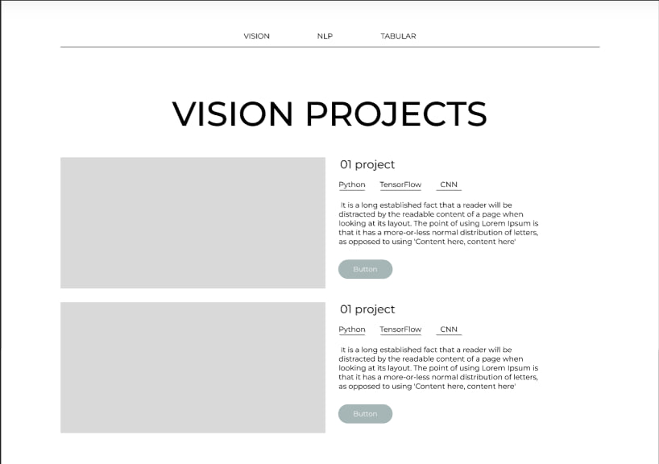

<div align="center">
    <h1>AI project</h1>
     
    <h3><a href="https://www.google.com">Live demo</a></h3>
</div>

<br>
<p>This is a website based on Flask used for hosting our AI models and implementing the full life cycle for them.</p>

<p>We've created different models from NLP (Natural Language Processing) and CV (Computer Vision) fields. A list of them you can see below.</p>

<p>Each model has a detail page where user can interact with the model using their own data. </p>
<a href="https://www.google.com">Try it by your own!</a>

### List of models

#### NLP:

- [*Tweet sentiment analysis*](/naïve_bayes/sentiment_analysis)
- [*Tweet disaster classification*](/naïve_bayes/tweet_disaster_classification)


#### CV:

- [*Animals classification*](/animals_classification) `IN PROGRESS`
- [*Weather classification*](/weather_classification) `IN PROGRESS`
- [*Military aircraft detection*](/military_aircraft_detection) `IN PROGRESS`
- [*Car license plate detection*](/license_plate_detection) `IN PROGRESS`

### Train models
#### Prepare environment
```
git clone https://github.com/cartiss/ai-app.git 
cd ai-app
poetry install
```
#### Choose model to train
- [*Tweet sentiment analysis*](/naïve_bayes/sentiment_analysis) 

```
make train_sentiment
```

- [*Tweet disaster classification*](/naïve_bayes/tweet_disaster_classification)

```
make train_disaster
```